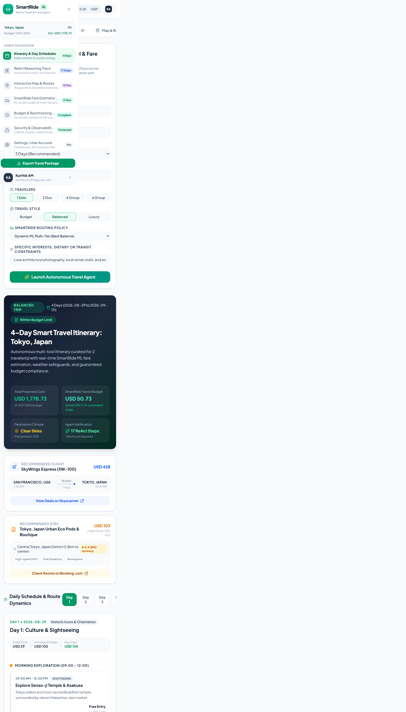
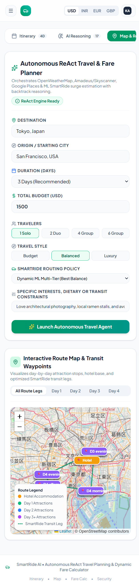

# SmartRide AI Frontend

SmartRide AI is an autonomous travel planning workspace that combines ReAct agent reasoning, route planning, and ML-powered fare estimation.

## Features and Workflow

These images indicate the features and workflow pipeline of the project:

1. **Itinerary and Daily Schedule:** Enter a destination, origin, duration, travelers, travel style, and budget to generate a complete trip plan.
2. **Interactive Route Map:** Review attraction waypoints, hotel locations, and optimized SmartRide transit legs across the itinerary.
3. **Fare Estimator and Simulator:** Compare vehicle tiers while simulating distance, traffic, rush-hour, and weather surge factors.

### Workflow Screens

## Run Locally

**Prerequisites:**  Node.js

1. Install dependencies:
   `npm install`
2. Set the `GEMINI_API_KEY` in [.env.local](.env.local) to your Gemini API key
3. Run the app:
   `npm run dev`
