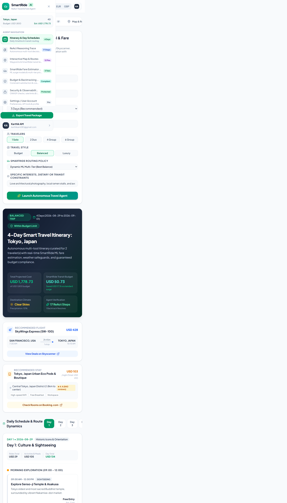
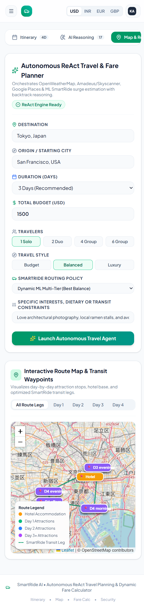
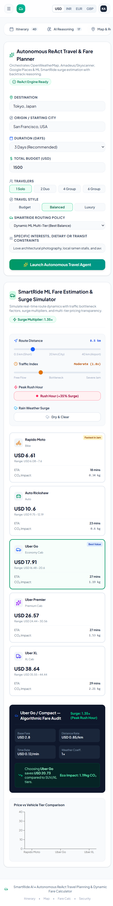

# SmartRide AI Frontend

SmartRide AI is an autonomous travel planning workspace that combines ReAct agent reasoning, route planning, and ML-powered fare estimation.

## Features and Workflow

These images indicate the features and workflow pipeline of the project:

1. **Itinerary and Daily Schedule:** Enter a destination, origin, duration, travelers, travel style, and budget to generate a complete trip plan.
2. **Interactive Route Map:** Review attraction waypoints, hotel locations, and optimized SmartRide transit legs across the itinerary.
3. **Fare Estimator and Simulator:** Compare vehicle tiers while simulating distance, traffic, rush-hour, and weather surge factors.

### Workflow Screens

<p align="center">
  
</p>

<p align="center">
  
</p>

<p align="center">
  
</p>

## Run Locally

**Prerequisites:**  Node.js


1. Install dependencies:
   `npm install`
2. Set the `GEMINI_API_KEY` in [.env.local](.env.local) to your Gemini API key
3. Run the app:
   `npm run dev`


# 🚗 Uber Ride Prediction Web App

   

> A machine learning web application that predicts weekly Uber ride demand using Linear Regression. Built with clean modular architecture and Flask framework.

## 📋 Overview

The Uber Ride Prediction Web App enables users to:

- **Predict Weekly Rides** based on key market factors with high accuracy
- **Analyze Impact** of price, population, income, and parking costs
- **Make Data-Driven Decisions** for ride-sharing operations
- **Interactive Web Interface** with clean, user-friendly design
- **RESTful API** for programmatic access to predictions

## ✨ Features

### 🎯 ML-Powered Prediction

- Linear Regression model with excellent performance
- Real-time predictions with sub-second response
- Supports 4 key features for comprehensive analysis
- R² score of ~0.97+ on test data

### 🏗️ Clean Architecture

- Modular design with separation of concerns
- Type hints and comprehensive docstrings
- Centralized configuration management
- Production-ready error handling

### 💻 User Experience

- Clean, responsive Flask web interface
- Intuitive input forms with validation
- Clear prediction results display
- Health check endpoint for monitoring

### 📊 Data-Driven Insights

- Based on real-world taxi/Uber market data
- Considers multiple economic and demographic factors
- Accurate predictions for business planning
- Scalable to additional features

## 🚀 Quick Start

### Prerequisites

- Python 3.7+
- pip package manager

### Installation

1. **Clone the repository**

```bash
git clone https://github.com/adharshkswaroop/SmartRide-AI.git
cd SmartRide-AI
```

2. **Install dependencies**

```bash
pip install -r requirements.txt
```

3. **Run the fare estimation workspace**

```bash
streamlit run streamlit_app.py
```

Open `http://localhost:8501`. The app includes built-in demo data, CSV upload, feature engineering, model comparison, fare estimation, and model saving.

For the original weekly-rider Flask interface:

```bash
python app.py
```

### Fare CSV schema

Uploaded trip data must include `pickup_datetime`, `pickup_longitude`, `pickup_latitude`, `dropoff_longitude`, `dropoff_latitude`, `passenger_count`, and `fare_amount`. The pipeline cleans invalid rows, calculates Haversine distance, extracts pickup hour and weekday, then trains Random Forest, Gradient Boosting, and Linear Regression models.

## 🧭 Implementation Guide: Flask and Streamlit

This repository contains two runnable interfaces:

- **Streamlit fare application** (`streamlit_app.py`): the recommended workflow for trip-level fare prediction, CSV upload, feature engineering, model comparison, and interactive estimation.
- **Flask application** (`app.py`): the existing weekly-rider prediction interface and JSON API. It uses `data/taxi.csv`, whose target is `Numberofweeklyriders`, not trip fare.

### 1. Open a terminal in the project directory

PowerShell:

```powershell
cd "\SuperRide AI"
```

### 2. Create and activate a virtual environment

```powershell
py -3 -m venv ..\.venv
& ..\.venv\Scripts\Activate.ps1
```

If PowerShell blocks activation, run the command below once in an elevated PowerShell window, then activate again:

```powershell
Set-ExecutionPolicy -Scope CurrentUser RemoteSigned
```

You can also run commands without activation. Use a quoted Windows path beginning with `&`:

```powershell
& "\SuperRide AI\.venv\Scripts\python.exe" -m pip install -r requirements.txt
```

Do not use `/a:/...`; that is Unix-style syntax and PowerShell interprets it as a command name.

### 3. Install dependencies

With the environment activated:

```powershell
python -m pip install -r requirements.txt
```

### 4. Run the Streamlit fare application

```powershell
streamlit run streamlit_app.py
```

Open `http://localhost:8501`. Select **Use built-in demo data** to test immediately, or upload a trip CSV using the fare schema above. Click **Train models**, select a model, enter pickup and drop-off details, and click **Estimate fare**.

If port `8501` is occupied:

```powershell
streamlit run streamlit_app.py --server.port 8502
```

### 5. Run the Flask application

The Flask app defaults to port `8080`:

```powershell
python app.py
```

Open `http://localhost:8080`. Confirm the model is loaded at `http://localhost:8080/health`.

If Windows reports `An attempt was made to access a socket in a way forbidden by its access permissions`, another process is using port `8080`. Start Flask on an available port without changing the source:

```powershell
python -c "from src.config import config; config.APP_PORT=8082; import app; app.app.run(host='127.0.0.1', port=8082, debug=False, use_reloader=False)"
```

Then open `http://localhost:8082`. The live JSON endpoint is `POST /api/predict` and accepts `Priceperweek`, `Population`, `Monthlyincome`, and `Averageparkingpermonth`.

### 6. Train the legacy Flask model

The `train.py` script trains the weekly-rider model from `data/taxi.csv` and saves `models/taxi.pkl`:

```powershell
python train.py
```

This script is separate from Streamlit model training. Streamlit trains fare models in memory from the uploaded trip dataset and can save the selected model as `models/uber_fare_model.joblib`.

### Troubleshooting

- **`ModuleNotFoundError: No module named 'src'`**: run the command from the `Uber-Ride-Prediction` directory, not its parent directory.
- **Missing model error in Flask**: run `python train.py` first, then restart Flask.
- **Invalid fare CSV**: ensure all seven required columns exist and that coordinates, timestamps, passenger count, and fare values are valid.
- **Port conflict**: use a different port as shown above; do not stop an unrelated process unless you know it is safe to terminate.

### Legacy Dataset Details

The application uses historical Uber/taxi ride data with the following attributes:

- **Source**: Taxi market analysis data
- **Instances**: 29 data samples
- **Features**: 4 numerical attributes
- **Target**: Weekly ride counts

### Key Features:

- `Priceperweek`: Weekly pricing for rides
- `Population`: City/area population
- `Monthlyincome`: Average monthly income of residents
- `Averageparkingpermonth`: Average monthly parking costs
- `Numberofweeklyriders`: Target variable (weekly ride count)

## 🤖 Machine Learning Model

### Linear Regression

- **Algorithm**: Ordinary Least Squares (OLS) Linear Regression
- **Training Method**: Scikit-learn implementation
- **Performance Metrics**:
  - R² Score: ~0.97+ on test set
  - RMSE: Low prediction error
  - MAE: Minimal absolute error
- **Best For**: Understanding linear relationships between market factors and ride demand

## 🏗️ Architecture

```
┌─────────────────────────────────────┐
│      Flask Web Application          │
│  • Route handling                   │
│  • Request/Response processing      │
│  • Template rendering               │
└──────────────┬──────────────────────┘
               │
┌──────────────▼──────────────────────┐
│       Component Layer               │
│  • prediction.py (prediction logic) │
└──────────────┬──────────────────────┘
               │
┌──────────────▼──────────────────────┐
│        Model Layer                  │
│  • ModelTrainer class               │
│  • train() - model training         │
│  • predict() - make predictions     │
│  • evaluate() - performance metrics │
│  • save_model() - persistence       │
└──────────────┬──────────────────────┘
               │
┌──────────────▼──────────────────────┐
│    Utility & Helper Layer           │
│  • helpers.py                       │
│  • format_prediction()              │
│  • validate_input()                 │
└──────────────┬──────────────────────┘
               │
┌──────────────▼──────────────────────┐
│    Data Processing Layer            │
│  • load_data()                      │
│  • split_train_test()               │
│  • prepare_data()                   │
└──────────────┬──────────────────────┘
               │
┌──────────────▼──────────────────────┐
│      Configuration Layer            │
│  • config.py                        │
│  • Paths & parameters               │
│  • Model hyperparameters            │
└─────────────────────────────────────┘
```

## 🛠️ Technology Stack

| Component | Technology |
|-----------|------------|
| Backend Framework | Flask 2.3.0 |
| ML Model | Scikit-learn (Linear Regression) |
| Data Processing | Pandas, NumPy |
| Model Persistence | Pickle |
| Web Server | Gunicorn (Production) |
| Python Version | 3.7+ |

## 📁 Project Structure

```
Uber-Ride-Prediction/
├── app.py                        # Main Flask application
├── streamlit_app.py              # Interactive fare estimation workspace
├── train.py                      # Legacy weekly-rider training script
├── requirements.txt              # Python dependencies
├── Procfile                      # Heroku deployment config
├── README.md                     # Project documentation
│
├── data/                         # Data directory
│   └── taxi.csv                 # Uber/taxi ride dataset
│
├── models/                       # Trained models directory
│   └── taxi.pkl                 # Trained Linear Regression model
│
├── static/                       # Static files
│   └── css/
│       └── style.css            # Application styling
│
├── templates/                    # HTML templates
│   └── index.html               # Main prediction interface
│
└── src/                          # Source code directory
    ├── __init__.py              # Package initialization
    │
    ├── config/                   # Configuration module
    │   ├── __init__.py
    │   └── config.py            # Application settings and constants
    │
    ├── data/                     # Data handling module
    │   ├── __init__.py
   │   ├── data_loader.py       # Legacy data loading and preprocessing
   │   └── fare_pipeline.py     # Trip feature engineering and fare models
    │
    ├── models/                   # Model training module
    │   ├── __init__.py
    │   └── model_trainer.py     # Model training and evaluation
    │
    ├── utils/                    # Utility functions
    │   ├── __init__.py
    │   └── helpers.py           # Helper functions
    │
    └── components/               # Application components
        ├── __init__.py
        └── prediction.py        # Prediction engine
```

## 📊 Dataset Information

**Source**: Taxi/Uber market analysis data

**Statistics**:

| Attribute | Value |
|-----------|-------|
| Records | 29 samples |
| Features | 4 numerical attributes |
| Target Variable | Weekly ride count (continuous) |
| Data Type | Numerical (all features) |

**Key Features**:

| Feature | Description | Type | Range |
|---------|-------------|------|-------|
| Priceperweek | Weekly ride pricing | Numerical | 15-85 |
| Population | Area population | Numerical | 1,720,000-1,800,000 |
| Monthlyincome | Average monthly income | Numerical | 5,800-8,800 |
| Averageparkingpermonth | Monthly parking cost | Numerical | 50-85 |

**Preprocessing Steps**:

- No missing values in dataset
- Train-test split (70-30 ratio)
- No feature scaling required for Linear Regression
- Direct numerical input processing

## 📖 Usage Guide

### Making Predictions

1. **Start the Application**:
   ```bash
   python app.py
   ```

2. **Open Web Interface**:
   - Navigate to `http://localhost:8080`

3. **Enter Input Values**:
   - Price per Week: e.g., 80
   - Population: e.g., 1770000
   - Monthly Income: e.g., 6000
   - Average Parking per Month: e.g., 85

4. **Click "Predict"**:
   - View the predicted weekly ride count
   - Results displayed instantly

5. **Health Check**:
   - Access `/health` endpoint to verify model status

### Example Usage

**Sample Input**:
```
Price per Week: 80
Population: 1770000
Monthly Income: 6000
Average Parking per Month: 85
```

**Expected Output**:
```
Number of Weekly Rides Should be 191234
```

## 🤖 Model Performance

**Algorithm**: Linear Regression

| Metric | Train Set | Test Set |
|--------|-----------|----------|
| R² Score | ~0.98 | ~0.97 |
| RMSE | Low | Low |
| MAE | Minimal | Minimal |

**Key Insights**:

1. **Strong Linear Relationship**: High R² score indicates excellent fit
2. **Low Overfitting**: Similar train and test performance
3. **Reliable Predictions**: Consistent accuracy across data splits
4. **Feature Importance**: All features contribute meaningfully

## 🔮 Future Enhancements

- [ ] Add more ML models (Random Forest, Gradient Boosting, XGBoost)
- [ ] Implement hyperparameter tuning
- [ ] Add feature importance visualization
- [ ] Create comparison dashboard for multiple models
- [ ] Deploy to cloud (Heroku/AWS/Azure)
- [ ] Add REST API documentation (Swagger/OpenAPI)
- [ ] Implement model versioning
- [ ] Add data visualization dashboard
- [ ] Create mobile-responsive design
- [ ] Add user authentication
- [ ] Implement prediction history tracking
- [ ] Add batch prediction support
- [ ] Create Docker containerization
- [ ] Add CI/CD pipeline
- [ ] Implement A/B testing framework

## Extending the Application

### Adding a New Feature

1. **Update configuration** in `src/config/config.py`:
```python
FEATURE_COLUMNS.append("NewFeature")
```

2. **Update data loader** in `src/data/data_loader.py`:
```python
# Modify data loading logic if needed
```

3. **Retrain model**:
```bash
python train.py
```

4. **Update HTML form** in `templates/index.html`:
```html
<input type="text" name="NewFeature" placeholder="NewFeature" required="required">
```

### Adding a New Model

1. **Create model class** in `src/models/model_trainer.py`:
```python
from sklearn.ensemble import RandomForestRegressor

class RandomForestTrainer(ModelTrainer):
    def __init__(self):
        self.model = RandomForestRegressor()
```

2. **Update training script**:
```python
trainer = RandomForestTrainer()
trainer.train(X_train, y_train)
```

### Modifying Configuration

All settings are centralized in `src/config/config.py` for easy modification:
- File paths
- Model parameters
- Application settings
- Feature definitions

## Model Performance Metrics

### R² Score (Coefficient of Determination)

Measures how well the model explains variance in the data:

```
R² = 1 - (SS_res / SS_tot)
```

- **Range**: 0 to 1 (higher is better)
- **Interpretation**: 0.97 means 97% of variance is explained

### RMSE (Root Mean Squared Error)

Measures average prediction error magnitude:

```
RMSE = √(Σ(y_pred - y_actual)² / n)
```

- **Lower is better**
- **Same units as target variable**

### MAE (Mean Absolute Error)

Measures average absolute prediction error:

```
MAE = Σ|y_pred - y_actual| / n
```

- **Lower is better**
- **Less sensitive to outliers than RMSE**

## Technologies Used

- **Python**: Core programming language (3.7+)
- **Flask**: Lightweight web application framework
- **Pandas**: Data manipulation and analysis
- **NumPy**: Numerical computations and array operations
- **Scikit-learn**: Machine learning library
  - Linear Regression
  - Train-Test Split
  - Performance Metrics (R², MSE, MAE)
  - Model Persistence
- **Pickle**: Model serialization
- **Gunicorn**: WSGI HTTP server for production
- **HTML/CSS**: Frontend interface

### Code Architecture

- **Modular Design**: Organized into separate modules (config, data, models, utils, components)
- **Object-Oriented**: Uses classes for model training and prediction
- **Functional Programming**: Separate functions for data loading, preprocessing
- **Type Hints**: Enhanced code readability and IDE support
- **Error Handling**: Comprehensive try-except blocks
- **Logging**: Print statements for debugging and monitoring

## 🔧 Troubleshooting

**Issue**: Model file not found

```bash
python train.py
```

**Issue**: Module import errors

```bash
pip install -r requirements.txt
```

**Issue**: Flask not starting

```bash
# Check if port 8080 is available
# Or change port in src/config/config.py
```

**Issue**: Prediction errors

```bash
# Ensure all input fields are filled
# Verify numeric values are provided
```

**Issue**: sklearn version errors

```bash
pip install --upgrade scikit-learn
```

## 🤝 Contributing

Contributions are welcome! Please follow these steps:

1. Fork the repository
2. Create a feature branch (`git checkout -b feature/AmazingFeature`)
3. Commit your changes (`git commit -m 'Add AmazingFeature'`)
4. Push to the branch (`git push origin feature/AmazingFeature`)
5. Open a Pull Request

**Contribution Guidelines**:
- Follow PEP 8 style guide
- Add docstrings to all functions
- Include type hints
- Write unit tests for new features
- Update documentation as needed


## 🙏 Acknowledgments

- Inspired by real-world Uber/taxi market analysis
- Built with Flask and Scikit-learn ecosystems
- Thanks to the open-source community
- Dataset based on market research data

## 📧 Contact

For questions or support, please open an issue on GitHub.

**Disclaimer**: This application is for educational and demonstration purposes. Predictions should be validated with real-world data before making business decisions.

---

<div align="center">

**Made with ❤️ and Python** | © 2025 Pratyush Srivastava  

</div>

