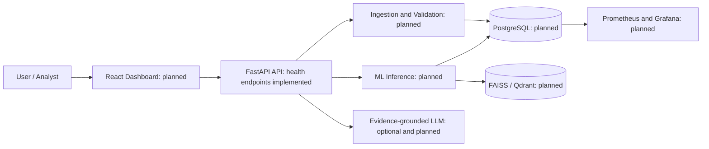
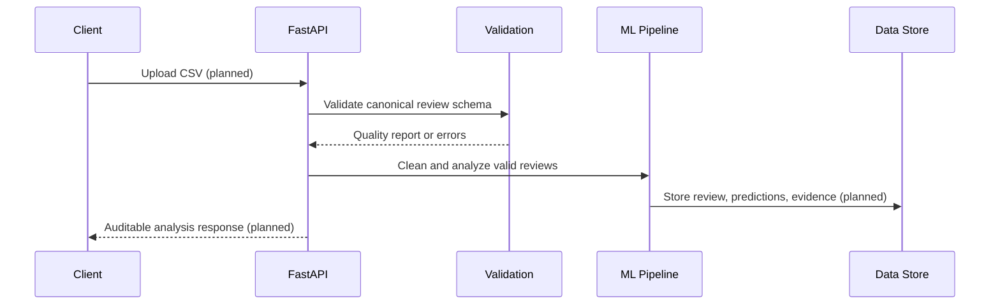

# Initial Architecture

## Scope

This document describes the target modular architecture. At Milestone 1, only the FastAPI health service is implemented. All data, ML, storage, frontend, monitoring, and deployment components below are planned.

## Design decisions

- The service is versioned under `/api/v1` while operational health endpoints remain available at the root.
- Raw review text will be retained alongside ML-cleaned text to support traceability.
- PostgreSQL is the intended system of record; vector storage is abstracted so local FAISS can later be replaced by Qdrant.
- Optional LLM providers receive structured, aggregated evidence and must return validated structured output.

## Target component diagram

## Intended review lifecycle

